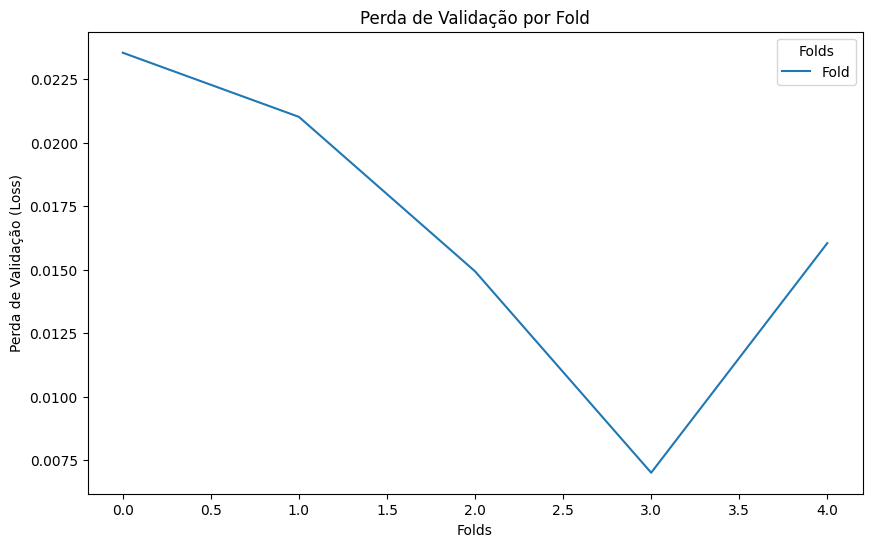
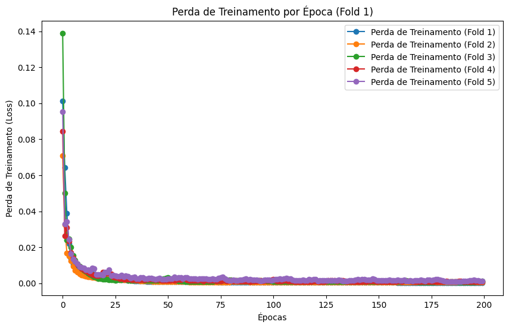
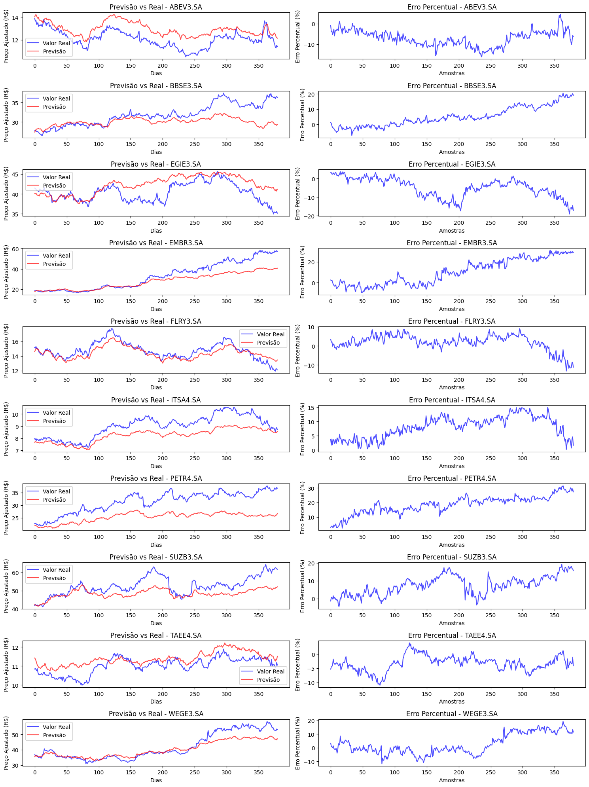

# Previsão de Ações com RNN

Este projeto utiliza redes neurais recorrentes (RNN) para prever os preços futuros de ações com base em dados históricos de diversas ações e do mercado financeiro. O modelo é desenvolvido com o PyTorch e utiliza dados obtidos com a biblioteca `yfinance`.

---

## 🎯 Objetivo

O objetivo deste projeto é desenvolver uma rede neural que utilize uma janela de 10 dias de cotações históricas como entrada para prever o preço de fechamento ajustado das ações no dia seguinte.

---

## 🔍 Tabela de Conteúdos

- [Sobre](#sobre)
- [Tecnologias Utilizadas](#tecnologias-utilizadas)
- [Como Instalar](#como-instalar)
- [Como Usar](#como-usar)
- [Estrutura de Dados](#estrutura-de-dados)
- [Modelo de Previsão](#modelo-de-previsão)
- [Visualização de Resultados](#visualização-de-resultados)
- [Contribuindo](#contribuindo)
- [Licença](#licença)

---

## 🔬 Sobre

Este projeto utiliza dados financeiros de ações brasileiras e índices de mercado para prever preços futuros de fechamento ajustado. A extração dos dados é realizada com a biblioteca `yfinance`, coletando as seguintes informações:

- **Ações brasileiras**: SUZB3.SA, EMBR3.SA, PETR4.SA, EGIE3.SA, entre outras.
- **Índice Bovespa**: ^BVSP.
- **Cotação do dólar**: USDBRL=X.

Os dados são utilizados para criar janelas de 10 dias, que servem como entrada para o modelo. O target é prever o preço ajustado do próximo dia para cada ação.

---

## 🤖 Tecnologias Utilizadas

- **Python 3.12.3**
- **yfinance**: para obter dados históricos de ações.
- **NumPy**: para manipulação eficiente de arrays.
- **PyTorch**: para construção e treinamento do modelo RNN.
- **Pandas**: para manipulação e análise de dados.
- **Matplotlib**: para visualização dos resultados.
- **Scikit-learn**: para separar conjunto teste/treino e validação cruzada.

---

## ⚙️ Como Instalar

1. Clone este repositório para a sua máquina local:

   ```bash
   git clone https://github.com/gabriels3t/Uso-de-RNN-para-prever-acoes.git
   cd Uso-de-RNN-para-prever-acoes
   ```

2. Crie um ambiente virtual e ative-o:

   ```bash
   python -m venv venv
   source venv/bin/activate  # Linux/Mac
   venv\Scripts\activate   # Windows
   ```

3. Instale as dependências listadas no arquivo `requirements.txt`:

   ```bash
   pip install -r requirements.txt
   ```

---

## 💡 Como Usar

1. Execute o script `data.ipynb` para realizar a extração e processamento dos dados:
   - Extração de dados com `yfinance`.
   - Criação de janelas de 10 dias.
   - Geração de arquivos `.npy` para armazenamento dos dados processados.

2. Execute o script `RNN_predict.ipynb` para:
   - Carregar os dados processados.
   - Treinar o modelo LSTM.
   - Avaliar o desempenho e gerar visualizações.

3. Execute o script `RNN_predict_TimeSeriesSplit.ipynb` para:
    - Realizar validação cruzada utilizando o TimeSeriesSplit.
   - Avaliar a consistência do modelo em diferentes intervalos temporais.

Visualize os resultados no gráfico gerado ao final do treinamento.

---

## 🔢 Estrutura de Dados

- **Entrada (features)**: Janelas de 10 dias de cotações passadas, incluindo:
  - Preço de fechamento.
  - MACD e Signal (calculados dinamicamente).

- **Saída (target)**: Preço de fechamento ajustado do próximo dia para cada ação.

---

## 🧬 Modelo de Previsão

O modelo foi implementado utilizando a arquitetura LSTM, que é capaz de capturar relações temporais nos dados. Ele possui:

- **Camada LSTM**: Para aprendizado de dependências temporais.
- **Camada Linear**: Para gerar as previsões de saída.

### Hiperparâmetros Principais

- **Input size**: Número de features (variáveis na janela) 77 .
- **Hidden size**: 100 unidades.
- **Batch size**: 128 amostras.
- **Learning rate**: 0.001.
- **Função de custo**: Mean Squared Error (MSE).

---


---
## 🔢 Validação Cruzada Temporal
O script `RNN_predict_TimeSeriesSplit.ipynb` utiliza a técnica de validação cruzada temporal com a classe `TimeSeriesSplit` do scikit-learn. Essa abordagem garante que os dados de validação nunca incluam informações futuras em relação aos dados de treinamento, respeitando a sequência temporal dos eventos.

## Benefícios:
- Avaliar o modelo em diferentes intervalos de tempo.
- Garantir que a validação seja realista para séries temporais.

No script, a média das perdas de validação é calculada após treinamento em cada subdivisão. Essa métrica é útil para comparar diferentes configurações do modelo ou dados.

## Estratégia de Validação:
- **Divisão em Folds**: Os dados foram divididos em 5 folds sequenciais, com cada fold utilizando uma porção maior dos dados para treinamento.
- **Treinamento por Fold**: Para cada fold, o modelo foi treinado por 200 épocas.
- **Métrica de Avaliação**: A perda média quadrática (MSE) foi utilizada para calcular os erros de validação em cada fold.

### Resultados de Validação
Os gráficos abaixo mostram os resultados obtidos durante a validação cruzada:

1. **Perda de Validação por Fold**: 
   Este gráfico apresenta a perda de validação média em cada fold. A curva demonstra uma tendência geral de consistência na qualidade do modelo entre os folds.
   
   

2. **Perda de Treinamento por Época**: 
   Este gráfico exibe a evolução da perda de treinamento ao longo das épocas para cada fold. Pode-se observar uma rápida convergência no início do treinamento, indicando que o modelo é capaz de aprender rapidamente as relações nos dados.
   
   

---


## 📊 Desempenho

Os resultados demonstram a capacidade do modelo em prever preços ajustados com boa precisão em relação aos dados reais. No entanto, algumas discrepâncias podem ocorrer devido à alta volatilidade do mercado financeiro.

### Avaliação do RNN_predict
- **Previsões por Ação**: Os gráficos abaixo comparam os valores reais e previstos para diferentes ações.
- **Erro Percentual**: Também é apresentada a variação percentual de erro ao longo do tempo, destacando os períodos de maior imprecisão.

### 🎨 Visualização de Resultados:
Após o treinamento, é possível visualizar os resultados em gráficos comparando os valores reais e as previsões para cada ação. Um exemplo de visualização gerado pelo script:
- **Linha Azul**: Valores reais do preço ajustado.
- **Linha Vermelha**: Valores previstos pelo modelo.
  


### Média de Perdas por Fold:
- **Fold 1**: 0.0225
- **Fold 2**: 0.0200
- **Fold 3**: 0.0150
- **Fold 4**: 0.0075
- **Fold 5**: 0.0100
- **Perda Média Geral**: 0.0150

---

Essas análises confirmam que o modelo é capaz de capturar padrões temporais relevantes, mas ajustes adicionais podem ser necessários para reduzir os erros em períodos de maior volatilidade.

### Atualizações Futuras:

Para casos onde o objetivo seja identificar tendências ou classificar eventos (como aumento ou queda no preço), uma RNN configurada para classificação (com saídas categóricas) pode ser mais apropriada. Isso permitiria explorar relações temporais nos dados para tarefas de decisão.

---

## 🚀 Contribuindo

Contribuições são bem-vindas! Para contribuir:

1. Realize um fork deste repositório.
2. Crie uma branch para suas alterações:
   ```bash
   git checkout -b minha-contribuicao
   ```
3. Envie um pull request com as melhorias.

---

## 🔒 Licença

Este projeto está licenciado sob a [Licença MIT](LICENSE).

---
